# Introduction #

The arrival of the Internet transformed our lives with endless websites to surf
and social media to enjoy -- however, despite offering unlimited connectivity it
can still been very difficult to use. For example - to connect remote devices,
requires complex programming and networking skills far beyond the capabilities
of the average user -- until NOW.

The arrival of the "Cloud" and "platform-as-a-service" is transforming how we
can connect and use the latest technology, without having to worry about a lot
of the underlying "magic" that holds this exciting world together.

In order to experience the magic, we are going to work through a very real
example to see how easy it can be. To make things as simple as possible, we have
included "code" for you to copy and paste.

**The challenge** - To connect to a remote sensor on the Internet, collect and
understand the data it generates and recording that data in a database. From
there the data can be analysed and shared via a website that we create.  

**Project Explanation**

To use the Internet of Things Cloud, we will be building a set of example applications, exploiting IBM's platform-as-a-service [Bluemix](http://www.bluemix.net), [Watson IOT](http://www.ibm.com/internet-of-things), and an
application development and runtime facility within Bluemix called [Node-RED](http://nodered.org).

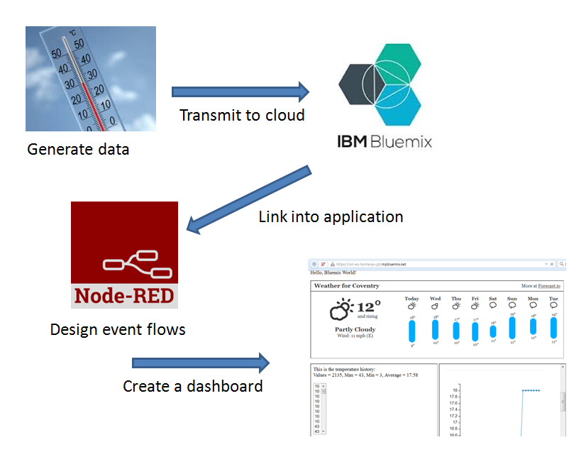

** Cross Sector Scenarios **

<dl>
<dt>Engineering</dt><dd>monitor the engine temperature of a racing car</dd>

<dt>Health and Social Care</dt><dd>to monitor the environmental temperatures for elderly patients</dd>

<dt>Science</dt><dd>to monitor the temperature of food storage areas</dd>

<dt>Business</dt><dd>to monitor the heating within a building to keep costs to a minimum</dd>

<dt>IT</dt><dd>to source data on temperatures within an environment to analyse to identify patterns or provide information</dd>
</dl>

# Node-RED and the Internet of Things #

It's easy to build an application with Node-RED, collect and store data to the
IBM Internet of Things cloud. This guide is divided into easy to follow
sections.

-   Identify the source of the data
-   Capture the data
-   Store the data
-   Check the data and validate against parameters
-   Take actions for data outside parameters (send a text, email notification
	etc)
-   Publish (such as to a website or a mobile application)

Workshop Activities
=================

[Getting Started](#getting-started)

[Create the basic Internet of Things application](#create-the-basic-internet-of-things-application)

[Import the sample sensor code](#import-the-sample-sensor-code)

[Identify input source for a simulated device](#identify-input-source-for-a-simulated-device)

[Viewing the import flow](#viewing-the-import-flow)

[Understanding and setting criteria for the data flow](#understanding-and-setting-criteria-for-the-data-flow)

[Using a database to store the saved Data](#using-a-database-to-store-the-saved-data)

[Display Data and Statistics](#display-data-and-statistics)

[Integrate warning messages into the flow](#integrate-warning-messages-into-the-flow)

	[Email Messages](#integrate-warning-messages-into-the-flow)

	[SMS text](#integrate-warning-messages-into-the-flow)

	[Adding Watson services to hear alerts](#integrate-warning-messages-into-the-flow)

[Create a simple web front-end in Bluemix](#create-a-simple-web-front-end-in-bluemix)

	[Edit the website to load the device history into a dashboard](#edit-the-website-to-load-the-device-history-into-a-dashboard)

	[Add dashboard components to the website using Node RED](#add-dashboard-components-to-the-website-using-node-red)

[Introducing a real IOT sensor](#introducing-a-real-iot-sensor)

Getting Started
===============

You'll need an IBM Bluemix account to be able to build the application in this
workshop -- if you don't already have one, sign up for a trial account at
<http://www.ibm.com/cloud-computing/bluemix/> and click on **GET STARTED
FREE**.

If you want to know more about Node-RED, see <http://nodered.org/docs/>.

Create the basic Internet of Things application
===============================================

-   Login to Bluemix ( https://console.ng.bluemix.net or
    <https://console.eu-gb.bluemix.net> )

-   Select the `CATALOG` tab

    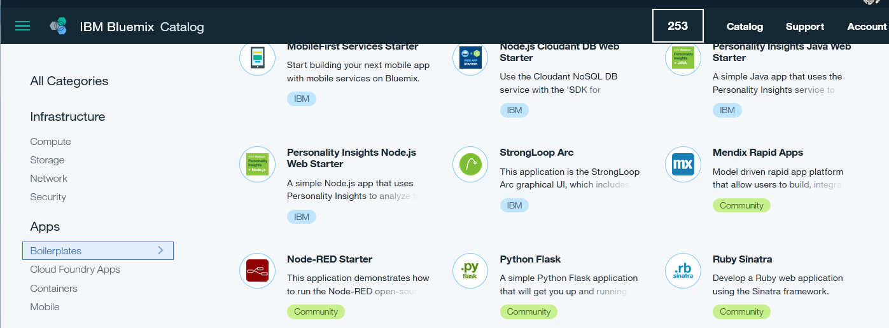

-   Select the `Node-RED Starter`

-   Under `Create an App` on the right name the application

	Choose a name that is unique in the **mybluemix.net** domain namespace -
	including your initials increases uniqueness (NOTE the same name will be
	used for the Host the application URL)

-   Select the `CREATE` button to load the boilerplate.

	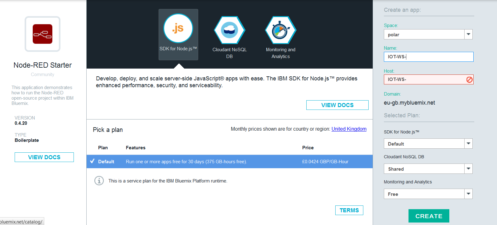

-   This can take a couple of minutes to load

    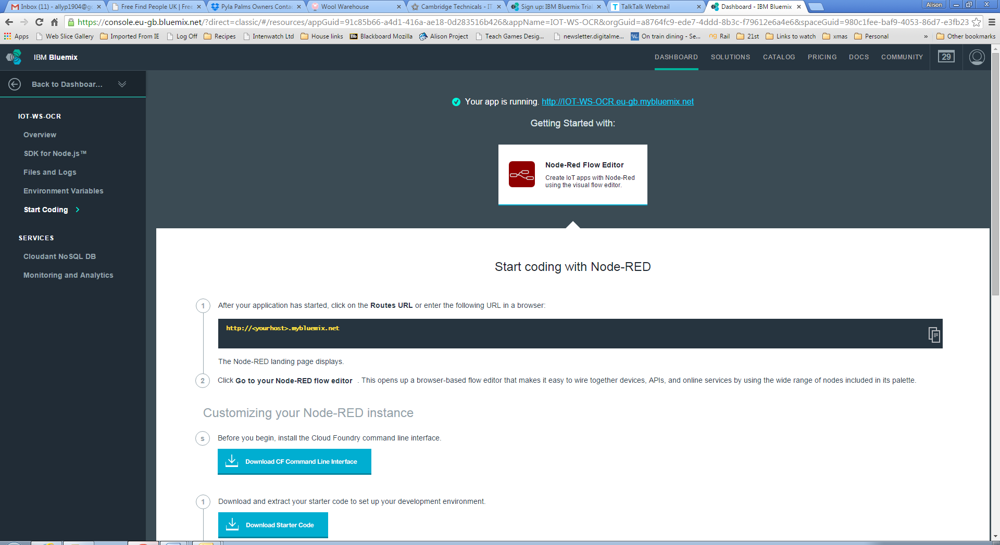

-   When the application shows as running select Back to Dashboard (top left).

    NB You can always return to the Dashboard for Navigation

    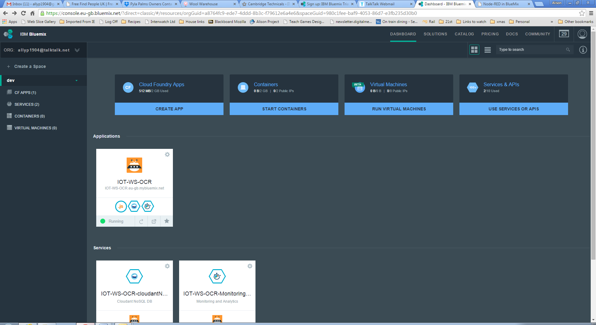

-   The App should show as running.

    *If the App is NOT running*

    *Click the area shown above as running*

    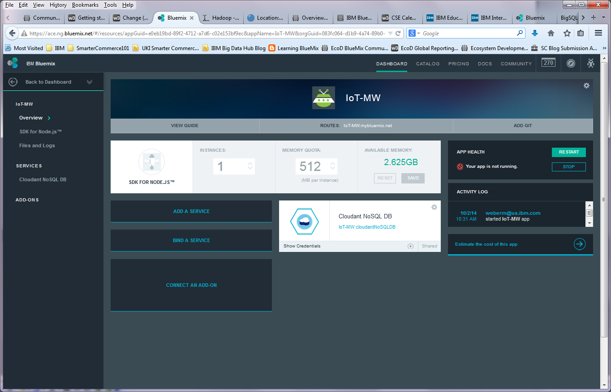

-   *Click the START (or RESTART) button and wait for the application to start*

    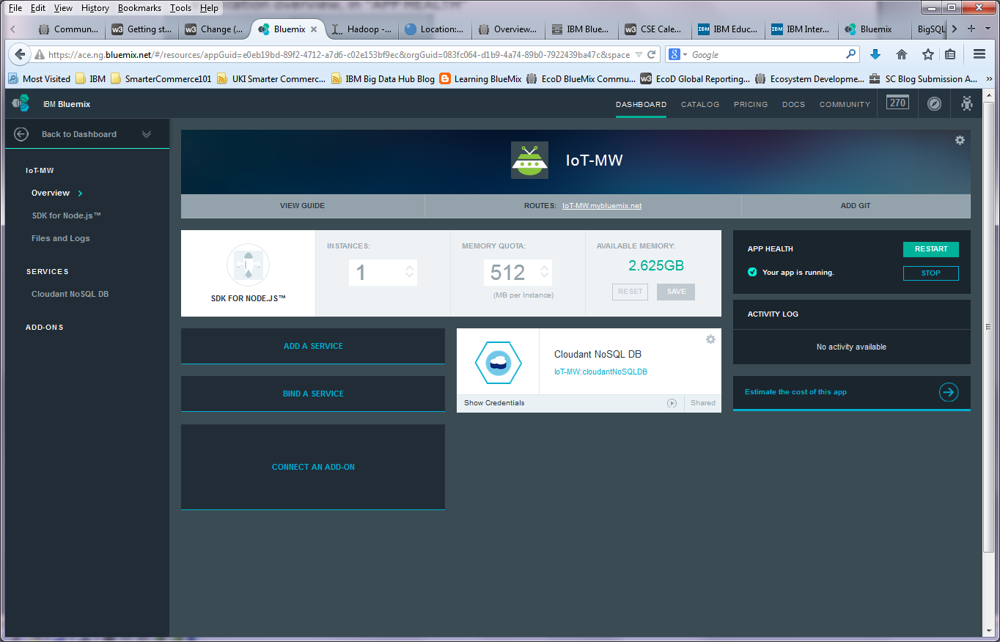

-   *Once the application is running, launch your app by clicking on the URL
    indicated by the `ROUTES` setting under the application name and icon at the
    top of the application overview:*

    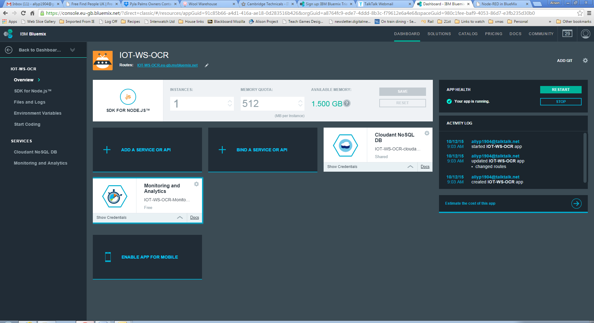

-   The Node-RED application will open in your browser. Scroll down and select
    the `Go to your Node-RED flow editor` button

	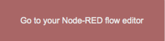

NB The Dashboard will remain open in a separate Tab.

Import the sample sensor code
=============================

Rather than creating or coding the application yourself, we have created the
code below for you to copy and paste. This can be modified later.

Copy all the text from the following plain text file:

[IOT flow example](./media/text/example-iot-flow-1.txt)

-   In the Node-RED flow editor select the menu (upper right of screen). Select
    `Import` then `Clipboard`

    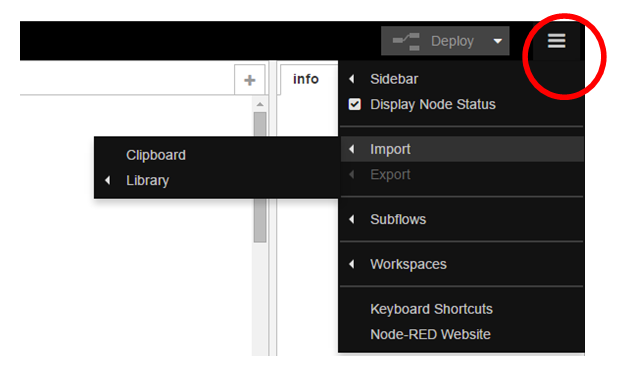

-   This will open an Import nodes window. Select into the window and paste (Ctrl+V, or 	Command+V), then press `OK`

    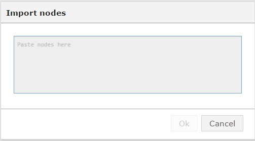

-   You should see the "flow" in the flow editor connected to your cursor.
    Position in the centre of the window and left-click to place.

-   Each block within the flow is called a node.

-   We'll be connecting the input in the `IoT APP Input` node:

    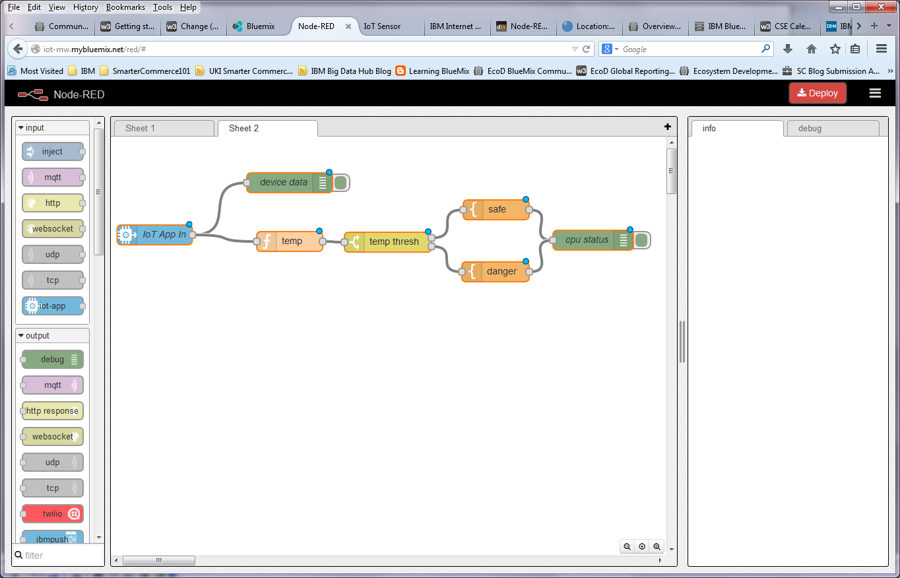

Identify input source for a simulated device 
=============================================

For further ease, there is a simulated device running on Bluemix ready for you
to use.

-   In a new browser window, open
    <http://quickstart.internetofthings.ibmcloud.com/iotsensor>

	

This is a temperature sensor, scrolling right and left provides other sensors
attributes; although these, or other physical sensors, can be used, the concept
is the same for all sector projects.

  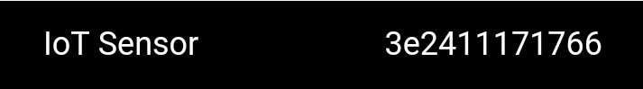

The alphanumeric text shown above is the MAC address of the simulated device.
You will need to make note of this. Click to open up the Data Dashboard web
console to see what data is being captured.

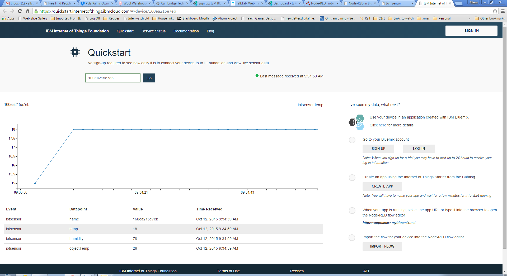

-   Keep this window open
-   Switch back to the Node-RED flow editor
-   Double-click the `IBM IoT App In` node (first node in the flow). This will
    bring up the node editor window

    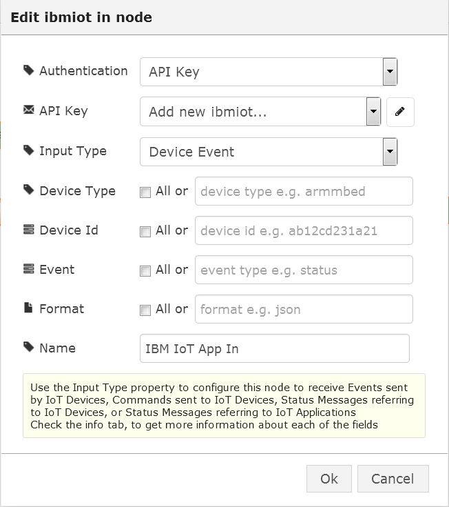

-   Change the **Authentication** attribute from **API Key**, or **Bluemix Service**, to **Quickstart**

-   Enter the **IOTSensor ID (MAC address)** in the **DeviceID** attribute

    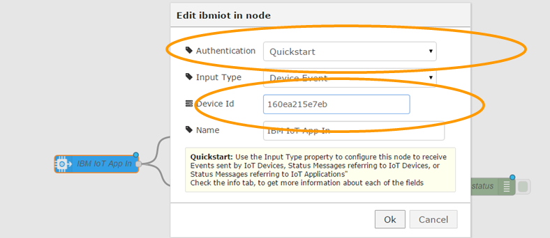

-   Click **OK**.
-   The red **Deploy** button (top right of the screen) now becomes active
-   Click **Deploy** to start importing the simulated readings

	

-   The capture of the simulated readings starts and the Deploy button becomes
	inactive.

Viewing the import flow 
=======================
-   In the side bar below the Deploy button, click on to the `debug` tab.
-   You should now see the debug messages from the flow, showing the
    temperature published by the sensor.

**NB** This is for awareness of live capture not a need to understand or edit code.

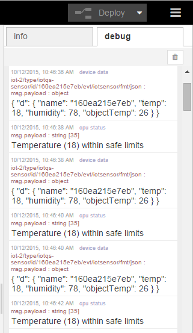

-   In the sensor simulator window, try altering the temperature being reported, then view the realtime sensor data on the sensor device Data Dashboard app you opened before.

    

-   Switch back to the Node-RED flow editor to watch the debug messages report
    the new readings.

-   Keep increasing the temperature until you get to 41ºC. The debug message
    should now be advising that the temperature is critical, based on preset
    criteria.

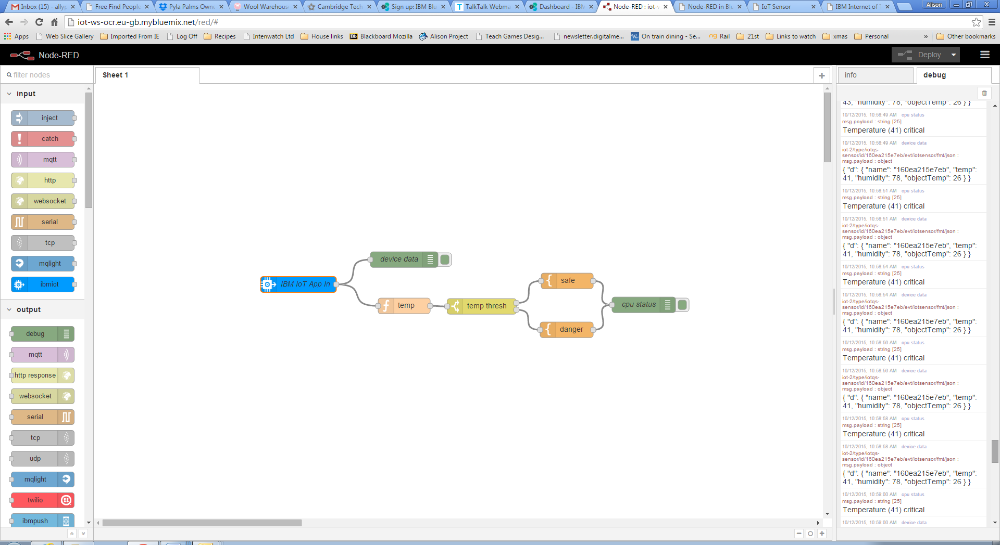

  
Experiment with the data and settings

You now have a device capturing readings from a sensor source.

You can enable or disable either of the 2 debug nodes in the flow by clicking in
the area to the right of the debug node, without needing to re-deploy the flow.
This approach helps to reduce the amount of debug information being displayed,
and allows you to concentrate on the sections of the flow that have been added
or changed.

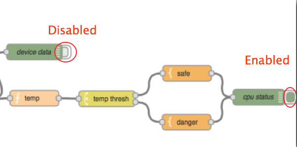

Understanding and setting criteria for the data flow
====================================================

You can examine the content of any node by **double clicking** it.

When you modify a node or add additional nodes the Deploy button will becomes
active again allowing you to deploy the modified settings.

The nodes in our flow each implement the steps as follows:

1.	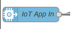 
	The iot input node identifies where to receive data from in Internet of
	Things (IoT) cloud

1.	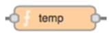
	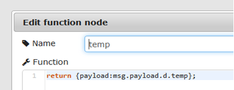 
	A function node (above) takes the data from the IoT node and extracts the
	temperature from the message

1.	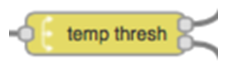
	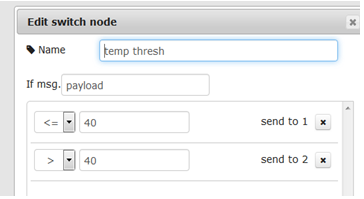 
	A decision switch node (above) allows you to compare values and send the
	flow one of 2 ways depending on readings received.

1.	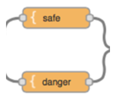
	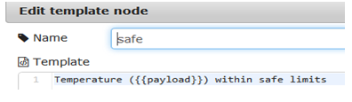 
	Function nodes (above) are where the user creates the message content to be
	displayed in the Debug node shown below.

1.	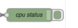
	The Debug node (above) displays the message to the Debug panel you used to
	view the data earlier.

Double click the nodes to view the options and potential modifications you can
make.

Once collected, the data within a flow can be Exported and saved to a filename
or the Clipboard.

Click the Menu (top right), select Export, Library

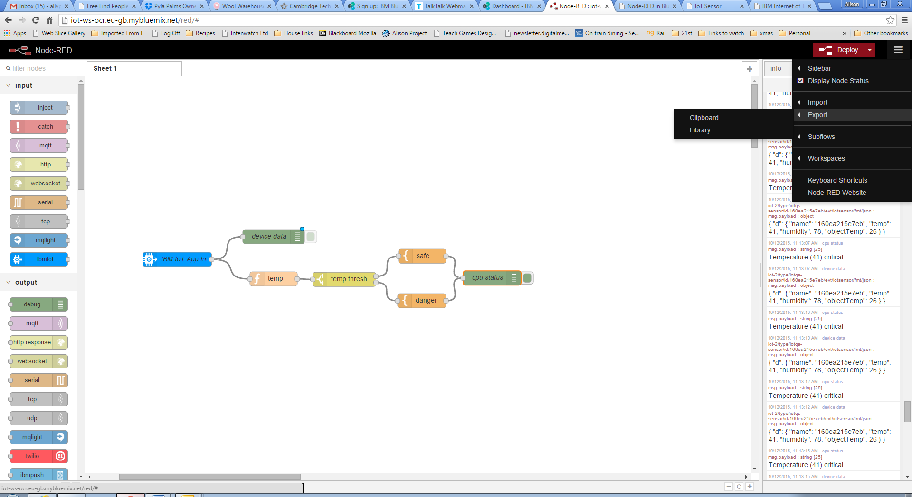

Enter a filename for the data being exported and click OK

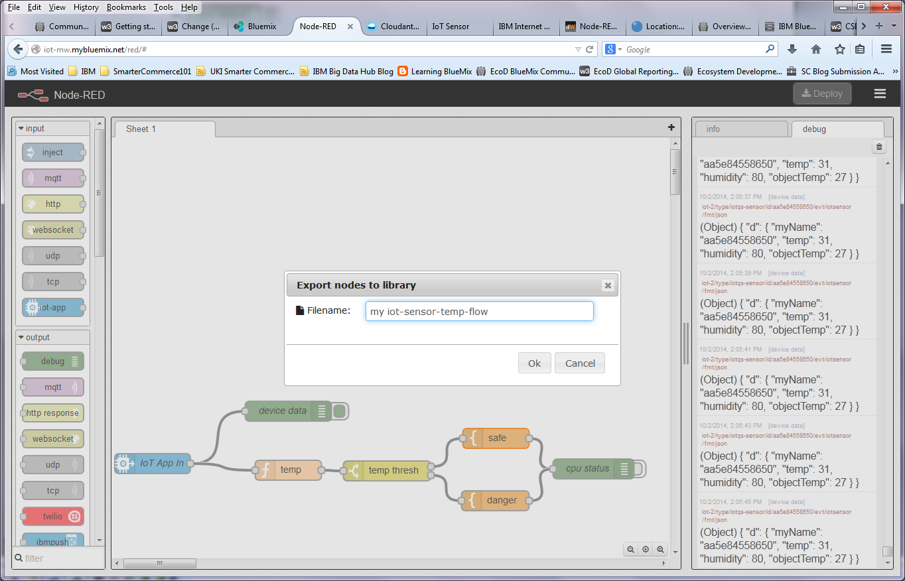

Using a database to store the saved Data
========================================

The IoT starter application template in the original Dashboard screen has a
service called the Cloudant database created and bound to the application.

There are many services you can explore later within the dashboard such as
Monitoring and Analytics which may also be visible.

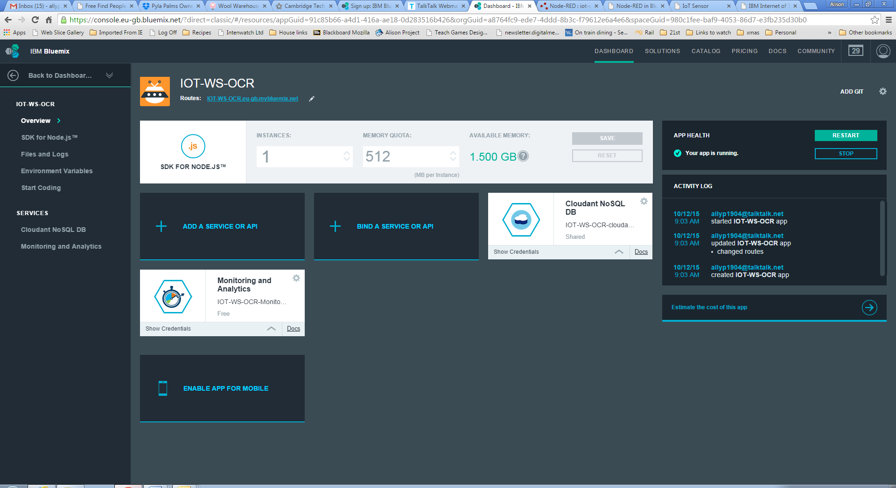

Switch to the Bluemix Dashboard, select your IoT application if not already
selected and click the **Cloudant NoSQLDB** service.

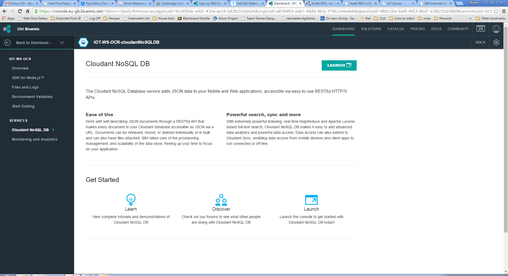

The dialog offers options to work with Cloudant, click on **Launch**.

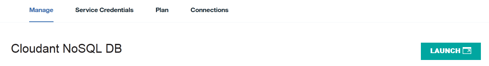

1.  Click on the **Databases** tab, if not already selected -- the list of
    Cloudant databases you have available are displayed, in this example there
    should be only one, **nodered**

	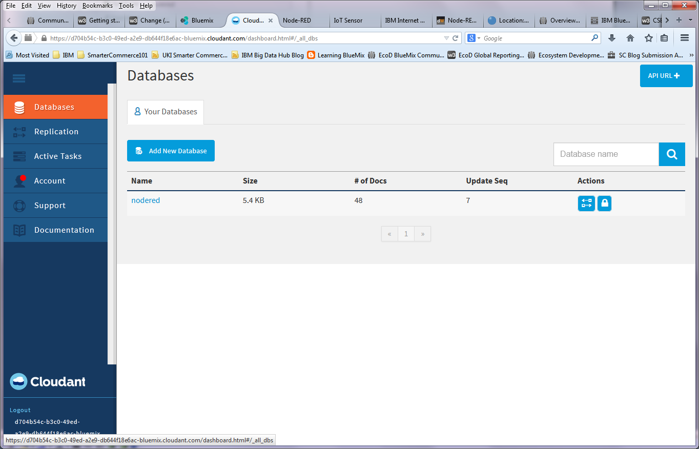

1.  Click on Add New Database, and name the database **iottemp**:

    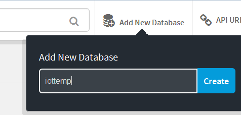

1.  Click **Create**

	Database entries will store the sensor events' data temperature object from our
	IoT application's Node-RED flow when we have aligned the application.

	Leave this window open as well as the others already running and switch back to
	the Node-RED window.

	Back in the Node-RED flow editor, scroll down through the node sections *Input*, *Output*, *Function* and *Social* to *Storage*, and select the `cloudant` output node  
	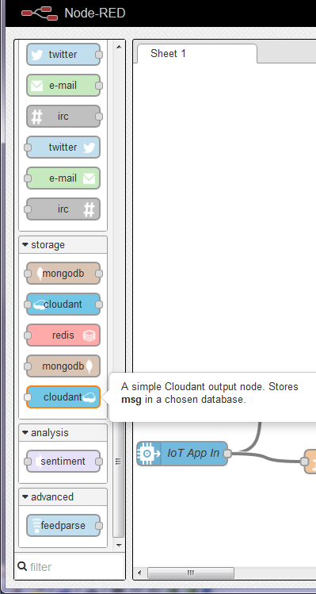 

1.  Click and drag the `cloudant` node into the flow editor window below the
    `temp threshold` decision node.

    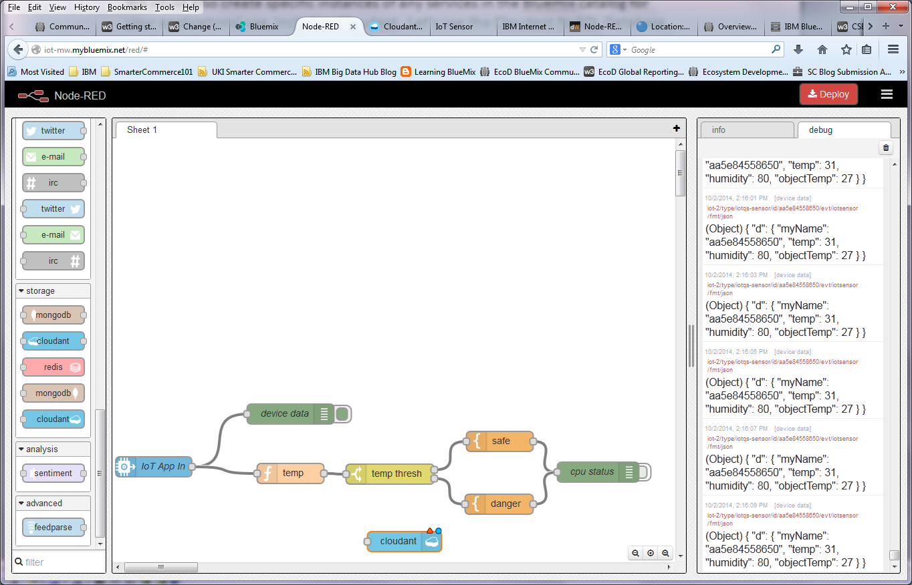

1.  Select the output of the `temp` node in the flow and connect it to the
    input of the `cloudant` node by clicking and dragging.

    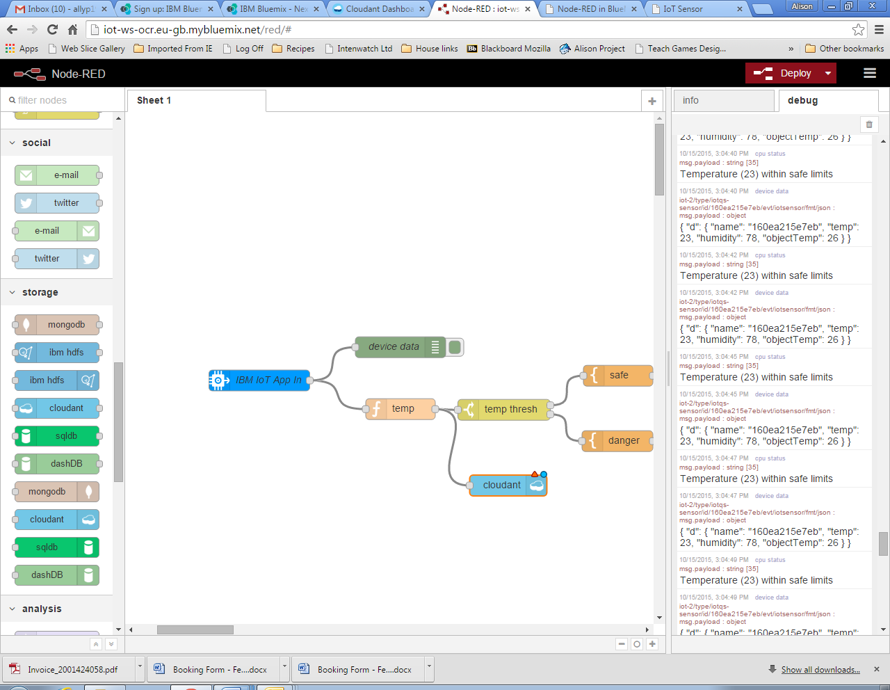

    A connector between the nodes is established; now let's specify the data
    storage service attributes and actions

1.  Double-click the `cloudant` node, to set up storage attributes and
    actions. In the **Edit cloudant out node** dialog, select or enter the
    following in each field:

	<dl>
		<dt>Service</dt><dd>select the service instance name for the
        <strong>IOT-WS-OCR-cloudantNoSQLDB</strong> from the list</dd>
		<dt>Database</dt><dd>specify <strong>iottemp</strong></dd>
		<dt>Operation</dt><dd>select <strong>insert</strong></dd>
		<dt>Name</dt><dd>specify <strong>temp</strong></dd>
	</dl>

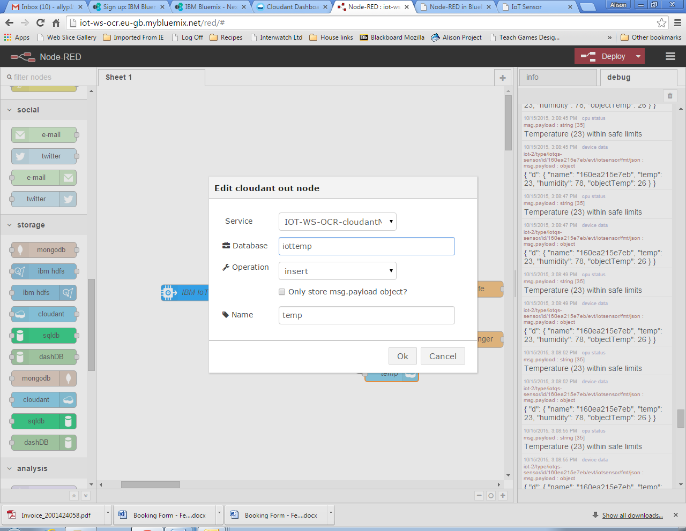

Click **OK** then click **Deploy** to redeploy/restart the flow

Entries should now be inserted to the Cloudant **iottemp** database in our
Cloudant data storage instance for the application.

We can use the Cloudant console to examine them. Switch back to the BlueMix
Cloudant Database screen.

1.  Select one of the entries by hovering over the entry -- the **Edit doc** icon
	should become active -- click to edit
	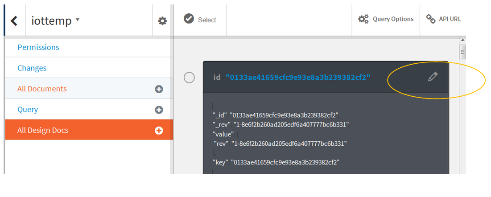

1.  The data object from the Node-RED flow for our IoT application is shown, we
	selected to store the *temp* payload attribute showing the sensor reading
	event's temperature setting - the other attributes for `id` and `rev` are
	generated by the Cloudant NoSQL DB storage service:
	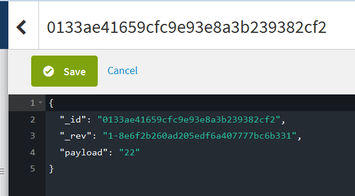

Display Data and Statistics
===========================

This section takes the data we have already captured in the Cloudant database
and allows you to present on a simple web page.

As new data is captured, the display will update itself periodically to reflect
new information.

As before, select and copy the following Node-RED flow and import into the flow
editor.

[IOT data view example](./media/text/example-iot-data-view-1.txt)

Click below the existing flow to add the new one

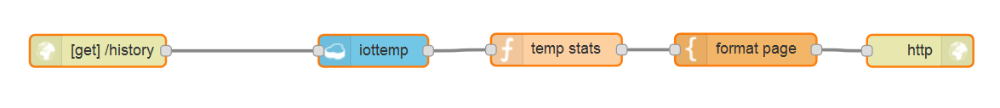

Open the cloudant node (`iottemp`) and update with the name of your Cloudant
service instance. Click Deploy.

The application will now accept a web request to the URL
<http://IOT-WS-OCR.eu-gb.bluemix.net/history>, retrieve all currently logged
temperature values from the Cloudant database, calculate current Min/Max/Average
values, and display on a webpage.

NB See later stages for the creation of the web page.

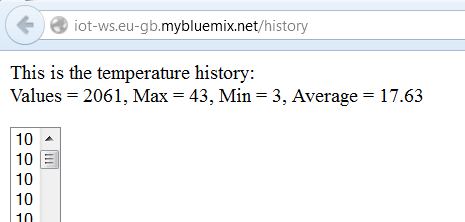

 Integrate warning messages into the flow
=========================================

Here we look at a variety of technicques and technologies for raising the alarm:
<dl> 
<dt><a href=/modules/email/Email-alerting-V6.md>Generate Email alerts</a> </dt>
<dd>Integrate message flow to **SMTP** services to send emails</dd>
<dt><a href=/modules/SMS/Twilio-SMS-V6.md>Add Twilio to raise alerts with SMS</a></dt>
<dd>Incorporate **SMS messaging** to send alerts to mobile devices</dd>
<dt><a href=/modules/Watson/Watson-speaks-V6.md>Adding Watson services to hear alerts</a></dt>
<dd>Using **Watson Cognitive** services to turn text into spoken messages</dd>
</dl>

Create a simple web front-end in Bluemix
========================================

In this section, you will be creating and tailoring the webpage to present the
data in the Bluemix environment. You will link the webpage to the Node-RED
application and display the results as a simple dashboard.

Add dashboard components to the website using Node RED
======================================================

The simple web data display is a little raw -- with new features available in Node-RED,
you can add graphical components simply and quickly.

Other content sources
=====================

To add a little context to the dashboard, bring in current temperature and
weather forecast for your location;

-   **forecast.io** provides a very simple embeddable chart that you can use at
    no charge. Take a look at <http://blog.forecast.io/forecast-embeds/>

-   **WeatherUnderground** (part of The Weather Company, an IBM Business) also
    offers "stickers" for adding weather to your webpages  go to
    <https://www.wunderground.com/stickers/?query=your-town,your-country> and
    select the sticker style that best suits you. An example:

	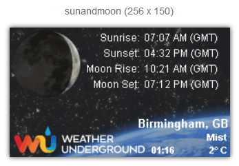

	There is also a WeatherUnderground node that can be added into the Node-RED
	palette -- this will provide raw forecast and current observation data into
	your application for you to use as needed. Note that you will need to
	register for a developer API key if you want to use the node.
	
	<https://www.wunderground.com/weather/api>

Introducing a real IOT sensor
=============================

So far, the data for the application has been generated by a web-based
simulator. Now, we will introduce real-world data using a prototyping kit from a
group of vendors who have configured their equipment to connect to the IBM
Internet of Things Foundation Quickstart service straight out of the box.

[Activating a physical IOT sensor device](/modules/IOT/IOT-real-sensors.md)

Now you can close the IOTSensor simulator, and your application will continue to
run.

Further reading
===============

More information on Node-RED and the IBM Internet of Things can be found :

<http://nodered.org>

<http://mqtt.org>

<https://www.ibmdw.net/iot/>

[Internet of Things Homepage](https://internetofthings.ibmcloud.com/#/)

[Connected Car - Traffic Simulator](http://trafficsimulator.mybluemix.net/)

[Connected Car - Traffic Simulator - how to implement the IoT
App](http://m2m.demos.ibm.com/trafficsimulator.html)

Recommended technical articles and examples:

-   [Bluemix and the Internet of
    Things](https://developer.ibm.com/bluemix/2014/07/16/bluemix-internet-things/)

-   [Build a cloud-ready temperature sensor with the Arduino Uno and the IBM IoT
    Foundation, Part 1: Build the circuit and set up the
    environment](http://www.ibm.com/developerworks/cloud/library/cl-bluemix-arduino-iot1/index.html)

-   [Build a cloud-ready temperature sensor with the Arduino Uno and the IBM IoT
    Foundation, Part 2: Write the sketch and connect to the IBM IoT Foundation
    Quickstart](http://www.ibm.com/developerworks/cloud/library/cl-bluemix-arduino-iot2/index.html)

-   [Build a cloud-ready temperature sensor with the Arduino Uno and the IBM IoT
    Foundation, Part 3: Build a custom application with
    Node-RED](http://www.ibm.com/developerworks/cloud/library/cl-arduino-iot3-app/index.html)

-   [Build a cloud-ready temperature sensor with the Arduino Uno and the IBM IoT
    Foundation, Part 4: Deploy a query
    GUI](http://www.ibm.com/developerworks/cloud/library/cl-arduino-iot4-app/index.html)
